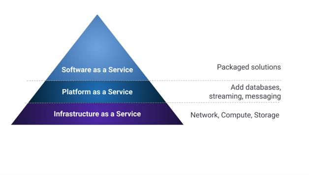
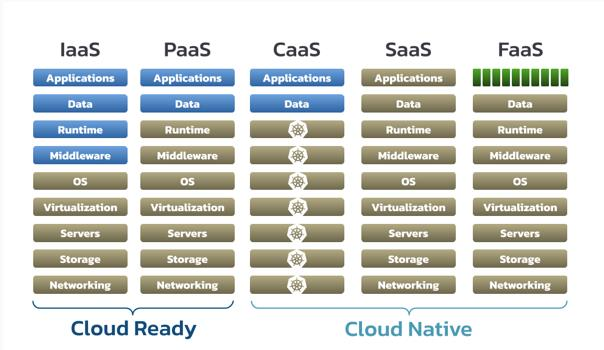
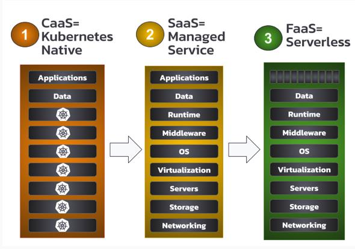
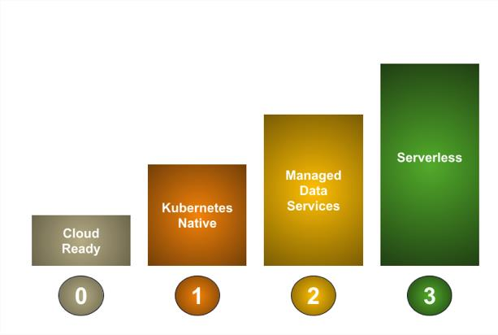
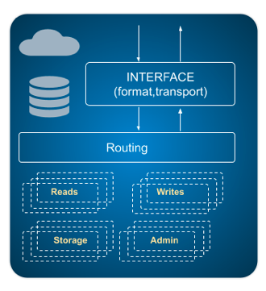

* content
{:toc}

>公司一直在利用 Kubernetes 和其他技术将工作负载转移到云端。但仍然存在一些棘手的挑战：如何处理数据层、您应该使用哪些技术、组织应该在哪里保存数据以及您应该如何移动数据？这些问题的中心是数据库。

>许多支持我们应用程序的数据库已经存在了很长时间——远在“云原生”的概念出现之前。今天，有一长串特性使数据库成为适合现代、可扩展应用程序的数据存储选项，包括可扩展性、弹性、弹性、可观察性和自动化（我们在最近的一篇文章“搜索云原生数据库”中对此进行了探讨”）。

>但是现代的云原生数据架构到底是什么样的呢？在本文中，我们将向您介绍云原生数据库的成熟度模型，以评估作为整体云架构一部分的数据层技术，并确保在整个堆栈中应用一致的成熟度级别。

## 云使用模式

> 让我们首先考虑一些描述云服务及其使用的传统模式。云服务的提供者和消费者都发现，通过 APIs 提供“即服务”的各种级别的能力是有用的。最初的模式集包括基础设施即服务 (IaaS)、平台即服务 (PaaS) 和软件即服务 (SaaS)。

>最近，出现了 PaaS 模式的其他变体，包括容器即服务 (CaaS) 和功能即服务 (FaaS)。让我们试着理解这些模式以及它们可以应用于我们的云架构的哪些地方。

> 从网络到应用程序层，并行对比这些模式，用这种方法检查这些模式更好，更详细。金色项目是云提供商的责任，而蓝色项目是消费者的责任：

> 这张图中展示了很多内容，所以让我们解开一些细节：

- 使用 IaaS，云提供商只供应您的服务器——您仍然需要提供用户帐户并安装应用程序所需的所有组件和中间件。
- 使用 PaaS，消费者的工作更少——您可以在现有运行时（例如应用程序服务器）中部署您的组件。
- 借助 SaaS（也称为托管服务），您可以通过 API 使用软件，这些 API 提供更高抽象级别的业务功能。

> PaaS 模式的两种变体已经出现，它们对于云原生应用程序开发的情景很重要：

- CaaS 是 PaaS 的一种，其中运行时是容器编排器，例如 Kubernetes。
- FaaS，有时也称为“无服务器”，是 PaaS 的更抽象版本，您可以在其中部署在端点后面调用的代码片段

> 请注意，这些模式可以组合。您的云生态系统可能包括部署在 IaaS 上的虚拟机 (VM)、部署在 CaaS 上的容器中的多个微服务、用于您不想自己实现的商品功能的第三方 SaaS、部署到 FaaS 以提供帮助的功能协调其他服务之间的工作流和数据流，等等。

## 云原生数据库成熟度模型

> 以这些云架构模式为背景，让我们将重点转向定义云原生数据库和数据服务的成熟度模型，使用 Bill Wilder 在其 2012 年出版的《云架构模式》一书中提出的云原生定义：“任何应用程序旨在充分利用云平台。”

> 根据此定义检查云使用模式，IaaS 和 PaaS 是我们可能称之为“云就绪”的东西，因为您可以按原样安装您希望的任何应用程序，无需调整。然而，这是以真正的云原生解决方案提供的灵活性为代价的。只有 CaaS、SaaS 和 FaaS 才能真正被认为是针对云进行架构的意义上的云原生，因此可以被认为代表了云原生架构的不同成熟度级别：

> 在这个模型中，我们将 CaaS 表示为“Kubernetes native”，SaaS 表示为“托管服务”，而 FaaS 表示为“‘serverless”。如果我们包含一个“云就绪”成熟度级别来表示 IaaS/PaaS 作为基线，我们会得到一个成熟度模型，如下所示：

> 让我们一个个地检查这些成熟度级别，从最不成熟到最成熟。

## 成熟度级别 0：Cloud-Ready Data 

> 第一个成熟度级别很容易达到；这是经典的提升和转换范例。任何可以部署在 IaaS 上的系统都将被视为云就绪。我们经常观察到的一种方式是部署在 VM 中的单体应用程序，其中包含一个嵌入式数据库。只要您可以将您的应用程序打包在一个（或多个）VM 中并连接任何所需的网络，您就可以在云中运行它。这是一个完全有效的部署选择，通常是公司上云的重要过渡步骤，但不能合法地被视为云原生。我们将目光定得更高一些，所以让我们进入下一个层次。

## 成熟度级别 1: Kubernetes-Native Data

> 此级别通常表示您已将单体应用程序分解为更小的微服务，这些微服务可以部署在容器中并独立扩展。这是重要的一步，但仅靠 Docker 这样的容器技术并不能提供管理应用程序生命周期和确保高可用性和可扩展性所需的一切。

> Docker runtime和 Docker-compose 非常适合开发和测试环境，但对于生产使用，您需要监控正在发生的事情并采取行动来维持您的服务水平。Kubernetes 等容器编排器正是为此目的而创建的。

> Kubernetes 的迅速采用是众所周知的。2020 年云原生计算基金会 (CNCF) 的一项调查发现，92% 的受访公司在生产中运行容器，其中 83% 的部署使用 Kubernetes。

> 鉴于 Kubernetes 在部署微服务和应用程序方面的流行，为什么我们没有看到更多的数据库部署在那里？虽然 Kubernetes 最初是为无状态工作负载设计的，但通过引入有状态集和持久卷（Cassandra是一个体现云原生原则并且可以有效部署到容器的数据库），已经取得了很大进展。

> 但是，由于数据库在 Kubernetes 上需要更长的时间才能成熟，因此我们经常观察到容器化应用程序将存储职责委托给在 Kubernetes 之外运行的组件的架构。一个例子是在虚拟机或裸机上运行的自我管理的数据库。这种方法导致网络和安全的复杂性增加，以及监控等功能的重复。委派存储责任的一种更原生的云方法是使用托管数据库服务，例如第三方提供商提供的服务。这将我们带到了下一个成熟度级别。

## 成熟度级别 2:Managed Data Services

> 仅在 Kubernetes 等容器化环境中部署数据库本身并不足以提供上述云原生数据库特性（可扩展性、弹性、弹性、可观察性和自动化）。要达到托管服务或“数据库即服务”(DBaaS) 的级别，您需要额外的操作逻辑，例如：
- 维护操作，包括扩展/缩减、备份/恢复、软件更新和故障排除
- 监控和可观察性，包括指标、日志记录和跟踪

> 例如，cass-operator是 Cassandra 的开源 Kubernetes 操作符，用于处理上述维护任务。K8ssandra是另一个基于 cass-operator 的开源项目，为在 Kubernetes 上部署和运行 Cassandra 提供完整的生态系统。这种方法使您可以灵活地创建自己定制的管理良好的 OSS 组件部署，该组件近似于第三方 DBaaS 的功能。

> 但是，要在数据领域提供成熟的 SaaS 解决方案，您需要“数据即服务”，而不仅仅是“数据库即服务”。不仅仅是支持 CQL 或 SQL 等数据库查询语言的端点，开发人员还渴望可以使用熟悉的语言和框架轻松访问的 API。这是另一个开源项目背后的动机——一个名为Stargate的数据网关。Stargate 提供了一个支持开发人员熟悉的 HTTP 访问模式的 RESTful API，一个新的 GraphQL API，它对 Web 和移动应用程序以及面向文档的无模式 API 尤其有用。

## 成熟度级别 3: Serverless Data

> 即使您拥有自己管理或从第三方消费的托管服务，仍然需要考虑成本挑战。这两种情况的经典问题是：如何根据工作负载的实际需求调整部署的资源量，以最大程度地减少浪费？即使在像 Cassandra 这样高度可扩展的弹性系统中，也很难独立扩展计算和存储资源。如果您只能扩展您需要的数据库部分会怎样？

> 这就是 FaaS 或无服务器方法的用武之地。通过将 Cassandra 等云原生数据库分解为更小的功能，可以更有效地分离和管理计算和存储利用率。接口、路由器、读取和写入成为可以独立扩展的独立功能。当您“扩展到零”时，该模型还可以提高弹性资源利用率，并支持多租户。

> 这种架构方法把对话方式由"我的数据库可以在 Kubernetes 中运行吗？"变为"我如何才能为我的特定数据库工作负载获得最低成本的解决方案？" 

> 随着云计算实践的不断成熟，重要的是我们将云原生架构原则应用于我们堆栈的所有层。我们认为，基于容器化 (CaaS)、托管服务 (SaaS) 和无服务器 (FaaS) 等最佳实践的云原生数据库成熟度模型代表了云中数据的有用成熟路径。像 K8ssandra 和 Stargate 这样的开源项目为行业合作提供了一个很好的机会，可以在数据层的成熟方面大踏步前进。我们很想听听您对此成熟度模型和此处介绍的技术的反馈。