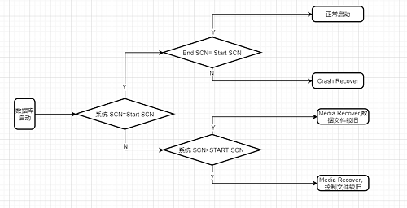

* content
{:toc}


## 什么是oracle多租户

> 多租户体系架构,使得oracle 数据库成为了一个多租户的容器数据库，也就是container database，也就是CDB。而一个CDB可以包含0个、一个或者多个用户创建的可插入的数据库，也就是pluggable database，也就是PDB，也就是所谓的“租户”。这就像合租房一样，每个租户可以获得其所需的各种资源。也可以说CDB就是各PDB的母体。


## 场景一：实例级别异常，或者直接abort CDB造成的影响

> 强制关闭实例，alert报错信息具体如下，可以看出速度很快


```
2020-10-08T16:41:20.052263+08:00
Shutting down ORACLE instance (abort) (OS id: 44064)
License high water mark = 22
2020-10-08T16:41:20.056957+08:00
USER (ospid: 44064): terminating the instance
2020-10-08T16:41:21.105925+08:00
Instance terminated by USER, pid = 44064
2020-10-08T16:41:27.225370+08:00
Instance shutdown complete (OS id: 44064)
```
> 启动数据库，可以看出实例级别的异常关闭和单实例差不多都会做crash recover，读取online redo进行恢复。
> 由于存在只读的种子pdb，关闭时不存在脏数据，不需要恢复。
> 完成恢复后开始启动归档进程，完成后，开始启动根容器，先初始化undo，然后校验数据文件头的兼容性。
> 根容器启动完成后，启动只读的种子pdb,然后开始顺序初始化pdb的undo表空间。
> 所有读写状态的pdb 初始化undo后，开启到读写状态。
> 到此，多租户数据库完成启动。

```
2020-10-08T16:45:47.823359+08:00
Crash Recovery excluding pdb 2 which was cleanly closed.
2020-10-08T16:45:47.828725+08:00
Beginning crash recovery of 1 threads
 Thread 1: Recovery starting at checkpoint rba (logseq 58 block 212340), scn 0
2020-10-08T16:45:47.845463+08:00
Started redo scan
2020-10-08T16:45:47.876868+08:00
Completed redo scan
 read 2038 KB redo, 189 data blocks need recovery
2020-10-08T16:45:47.907318+08:00
Started redo application at
 Thread 1: logseq 58, block 212340, offset 0
2020-10-08T16:45:47.907615+08:00
Recovery of Online Redo Log: Thread 1 Group 1 Seq 58 Reading mem 0
  Mem# 0: /u01/app/oracle/oradata/ORCL/redo01.log
2020-10-08T16:45:47.985148+08:00
Completed redo application of 0.66MB
2020-10-08T16:45:48.002440+08:00
Completed crash recovery at
 Thread 1: RBA 58.216417.16, nab 216417, scn 0x0000000000432963
 189 data blocks read, 189 data blocks written, 2038 redo k-bytes read
Endian type of dictionary set to little
2020-10-08T16:45:48.021072+08:00
LGWR (PID:44358): STARTING ARCH PROCESSES
```


>详细日志记录


```
Completed: ALTER DATABASE   MOUNT
2020-10-08T16:45:47.804710+08:00
ALTER DATABASE OPEN
Ping without log force is disabled:
  instance mounted in exclusive mode.
2020-10-08T16:45:47.823359+08:00
Crash Recovery excluding pdb 2 which was cleanly closed.
2020-10-08T16:45:47.828725+08:00
Beginning crash recovery of 1 threads
 Thread 1: Recovery starting at checkpoint rba (logseq 58 block 212340), scn 0
2020-10-08T16:45:47.845463+08:00
Started redo scan
2020-10-08T16:45:47.876868+08:00
Completed redo scan
 read 2038 KB redo, 189 data blocks need recovery
2020-10-08T16:45:47.907318+08:00
Started redo application at
 Thread 1: logseq 58, block 212340, offset 0
2020-10-08T16:45:47.907615+08:00
Recovery of Online Redo Log: Thread 1 Group 1 Seq 58 Reading mem 0
  Mem# 0: /u01/app/oracle/oradata/ORCL/redo01.log
2020-10-08T16:45:47.985148+08:00
Completed redo application of 0.66MB
2020-10-08T16:45:48.002440+08:00
Completed crash recovery at
 Thread 1: RBA 58.216417.16, nab 216417, scn 0x0000000000432963
 189 data blocks read, 189 data blocks written, 2038 redo k-bytes read
Endian type of dictionary set to little
2020-10-08T16:45:48.021072+08:00
LGWR (PID:44358): STARTING ARCH PROCESSES
2020-10-08T16:45:48.036886+08:00
TT00 (PID:44400): Gap Manager starting
Starting background process ARC0
2020-10-08T16:45:48.059024+08:00
ARC0 started with pid=37, OS id=44402 
2020-10-08T16:45:48.070278+08:00
LGWR (PID:44358): ARC0: Archival started
LGWR (PID:44358): STARTING ARCH PROCESSES COMPLETE
2020-10-08T16:45:48.071576+08:00
ARC0 (PID:44402): Becoming a 'no FAL' ARCH
ARC0 (PID:44402): Becoming the 'no SRL' ARCH
2020-10-08T16:45:48.087416+08:00
TMON (PID:44386): STARTING ARCH PROCESSES
Starting background process ARC1
Starting background process ARC2
2020-10-08T16:45:48.107924+08:00
ARC1 started with pid=39, OS id=44406 
2020-10-08T16:45:48.130520+08:00
ARC2 started with pid=40, OS id=44408 
Starting background process ARC3
2020-10-08T16:45:48.135338+08:00
Thread 1 advanced to log sequence 59 (thread open)
Redo log for group 2, sequence 59 is not located on DAX storage
2020-10-08T16:45:48.157178+08:00
ARC3 started with pid=41, OS id=44410 
2020-10-08T16:45:48.160575+08:00
TMON (PID:44386): ARC1: Archival started
TMON (PID:44386): ARC2: Archival started
TMON (PID:44386): ARC3: Archival started
TMON (PID:44386): STARTING ARCH PROCESSES COMPLETE
2020-10-08T16:45:48.175287+08:00
Thread 1 opened at log sequence 59
  Current log# 2 seq# 59 mem# 0: /u01/app/oracle/oradata/ORCL/redo02.log
Successful open of redo thread 1
2020-10-08T16:45:48.177013+08:00
MTTR advisory is disabled because FAST_START_MTTR_TARGET is not set
stopping change tracking
Undo initialization recovery: err:0 start: 29103115 end: 29103136 diff: 21 ms (0.0 seconds)
[44398] Successfully onlined Undo Tablespace 2.
Undo initialization online undo segments: err:0 start: 29103136 end: 29103201 diff: 65 ms (0.1 seconds)
Undo initialization finished serial:0 start:29103115 end:29103211 diff:96 ms (0.1 seconds)
Verifying minimum file header compatibility for tablespace encryption for pdb 1..
Verifying file header compatibility for tablespace encryption completed for pdb 1
Database Characterset is ZHS16GBK
No Resource Manager plan active
2020-10-08T16:45:48.861805+08:00
ARC2 (PID:44408): Archived Log entry 53 added for T-1.S-58 ID 0x5c6cc7bb LAD:1
2020-10-08T16:45:49.096616+08:00
joxcsys_required_dirobj_exists: directory object exists with required path /u01/app/oracle/product/19.0.0/dbhome_1/javavm/admin/, pid 44398 cid 1
replication_dependency_tracking turned off (no async multimaster replication found)
Starting background process AQPC
2020-10-08T16:45:49.385745+08:00
AQPC started with pid=43, OS id=44415 
PDB$SEED(2):Autotune of undo retention is turned on. 
PDB$SEED(2):Endian type of dictionary set to little
PDB$SEED(2):Undo initialization finished serial:0 start:29104799 end:29104799 diff:0 ms (0.0 seconds)
2020-10-08T16:45:50.110638+08:00
PDB$SEED(2):Database Characterset for PDB$SEED is ZHS16GBK
PDB$SEED(2):Opening pdb with no Resource Manager plan active
2020-10-08T16:45:51.584958+08:00
PDB2(5):Autotune of undo retention is turned on. 
2020-10-08T16:45:51.588237+08:00
PDB(3):Autotune of undo retention is turned on. 
2020-10-08T16:45:51.589843+08:00
PDB3(8):Autotune of undo retention is turned on. 
2020-10-08T16:45:51.594133+08:00
PDB1(4):Autotune of undo retention is turned on. 
2020-10-08T16:45:51.629439+08:00
PDB2(5):Endian type of dictionary set to little
2020-10-08T16:45:51.634199+08:00
PDB3(8):Endian type of dictionary set to little
2020-10-08T16:45:51.636126+08:00
PDB1(4):Endian type of dictionary set to little
2020-10-08T16:45:51.637274+08:00
PDB(3):Endian type of dictionary set to little
PDB(3):Undo initialization recovery: err:0 start: 29106654 end: 29106717 diff: 63 ms (0.1 seconds)
2020-10-08T16:45:52.066744+08:00
PDB1(4):Undo initialization recovery: err:0 start: 29106702 end: 29106780 diff: 78 ms (0.1 seconds)
2020-10-08T16:45:52.237339+08:00
PDB(3):[44422] Successfully onlined Undo Tablespace 2.
PDB(3):Undo initialization online undo segments: err:0 start: 29106717 end: 29106959 diff: 242 ms (0.2 seconds)
PDB(3):Undo initialization finished serial:0 start:29106654 end:29106977 diff:323 ms (0.3 seconds)
PDB(3):Database Characterset for PDB is ZHS16GBK
2020-10-08T16:45:52.344003+08:00
PDB1(4):[44424] Successfully onlined Undo Tablespace 2.
PDB1(4):Undo initialization online undo segments: err:0 start: 29106780 end: 29107058 diff: 278 ms (0.3 seconds)
PDB1(4):Undo initialization finished serial:0 start:29106702 end:29107079 diff:377 ms (0.4 seconds)
PDB1(4):Database Characterset for PDB1 is ZHS16GBK
2020-10-08T16:45:52.712874+08:00
PDB3(8):Undo initialization recovery: err:0 start: 29107346 end: 29107426 diff: 80 ms (0.1 seconds)
2020-10-08T16:45:52.716605+08:00
PDB2(5):Undo initialization recovery: err:0 start: 29107366 end: 29107430 diff: 64 ms (0.1 seconds)
PDB2(5):[44426] Successfully onlined Undo Tablespace 2.
PDB2(5):Undo initialization online undo segments: err:0 start: 29107430 end: 29108107 diff: 677 ms (0.7 seconds)
2020-10-08T16:45:53.393947+08:00
PDB3(8):[44428] Successfully onlined Undo Tablespace 2.
PDB3(8):Undo initialization online undo segments: err:0 start: 29107427 end: 29108108 diff: 681 ms (0.7 seconds)
PDB3(8):Undo initialization finished serial:0 start:29107346 end:29108124 diff:778 ms (0.8 seconds)
2020-10-08T16:45:53.415590+08:00
PDB2(5):Undo initialization finished serial:0 start:29107366 end:29108125 diff:759 ms (0.8 seconds)
PDB2(5):Database Characterset for PDB2 is ZHS16GBK
2020-10-08T16:45:53.424100+08:00
PDB3(8):Database Characterset for PDB3 is ZHS16GBK
2020-10-08T16:45:54.275883+08:00
PDB(3):Opening pdb with no Resource Manager plan active
2020-10-08T16:45:54.472309+08:00
PDB1(4):Opening pdb with no Resource Manager plan active
2020-10-08T16:45:54.512587+08:00
PDB(3):joxcsys_required_dirobj_exists: directory object exists with required path /u01/app/oracle/product/19.0.0/dbhome_1/javavm/admin/, pid 44422 cid 3
Pluggable database PDB opened read write
2020-10-08T16:45:54.651632+08:00
PDB1(4):joxcsys_required_dirobj_exists: directory object exists with required path /u01/app/oracle/product/19.0.0/dbhome_1/javavm/admin/, pid 44424 cid 4
Pluggable database PDB1 opened read write
2020-10-08T16:45:55.598182+08:00
PDB3(8):Opening pdb with no Resource Manager plan active
2020-10-08T16:45:55.600271+08:00
PDB2(5):Opening pdb with no Resource Manager plan active
PDB2(5):joxcsys_required_dirobj_exists: directory object exists with required path /u01/app/oracle/product/19.0.0/dbhome_1/javavm/admin/, pid 44426 cid 5
2020-10-08T16:45:55.941137+08:00
PDB3(8):joxcsys_required_dirobj_exists: directory object exists with required path /u01/app/oracle/product/19.0.0/dbhome_1/javavm/admin/, pid 44428 cid 8
Pluggable database PDB3 opened read write
2020-10-08T16:45:56.084235+08:00
Pluggable database PDB2 opened read write
2020-10-08T16:45:56.267948+08:00
Starting background process CJQ0
2020-10-08T16:45:56.301151+08:00
CJQ0 started with pid=51, OS id=44439 
Completed: ALTER DATABASE OPEN

```


## 场景二 abort关闭pdb，会造成什么影响。


> 强制关闭pdb

```
 alter pluggable database pdb close abort ; 
```

> 告警日志如下，可以看出，3号容器直接标记为abort，清楚3号容器在buffer cache的信息，**此处应该是强制清除，肯定会出现脏块，是否会出现partial write 不确定，数据文件一致性不确定**

> 可以猜想，由于控制文件是多库共享的，只关闭一个pdb，实例正常，系统的scn是一直推进的，根据数据库的启动逻辑，该情况需要做，media recover，使用老的数据文件+新的控制文件进行恢复。


**oracle数据库启动逻辑图**



```


SQL> alter session set container =pdb ;

Session altered.

SQL> select con_id,checkpoint_change# from v$database;   

    CON_ID CHECKPOINT_CHANGE#
---------- ------------------
         0            4550979


```

> 告警日志


```
2020-10-08T22:12:15.617166+08:00
alter pluggable database pdb close abort 
2020-10-08T22:12:15.632817+08:00
PDB(3):JIT: pid 44398 requesting stop
2020-10-08T22:12:15.637378+08:00
PDB(3):PDB Close Abort marking the Control File to indicate pdb 3 as aborted for tno 1
PDB(3):Buffer Cache invalidation for PDB 3 started
PDB(3):Buffer Cache invalidation for PDB 3 complete
2020-10-08T22:12:15.803916+08:00
PDB(3):While transitioning the pdb 3 to clean state, clearing all its abort bits in the control file.
Pluggable database PDB closed
2020-10-08T22:12:21.986428+08:00
Completed: alter pluggable database pdb close abort 
```

> 启动pdb，检查告警日志,数据文件需要media recover，说明强制关闭pdb后，必须做media recover 才能恢复，如果日志丢失，pdb将不能恢复。

>猜想得到验证，强制关闭pdb之后，由于实例正常运行，系统的scn一直往前推进，重新启动pdb需要进行meidia recover，因为系统SCN > start SCN


```

2020-10-08T23:19:14.742796+08:00
alter pluggable database pdb open 
PDB(3):Autotune of undo retention is turned on. 
2020-10-08T23:19:15.011550+08:00
Pdb PDB hit error 1113 during open read write (1) and will be closed.
2020-10-08T23:19:15.012076+08:00
Errors in file /u01/app/oracle/diag/rdbms/orcl/orcl/trace/orcl_ora_68393.trc:
ORA-01113: file 12 needs media recovery
ORA-01110: data file 12: '/u01/app/oracle/oradata/ORCL/pdb/users01.dbf'
PDB(3):JIT: pid 68393 requesting stop
2020-10-08T23:19:15.105368+08:00
Errors in file /u01/app/oracle/diag/rdbms/orcl/orcl/trace/orcl_mz00_68411.trc:
ORA-01110: data file 9: '/u01/app/oracle/oradata/ORCL/pdb/system01.dbf'
ORA-01208: data file is an old version - not accessing current version
PDB(3):Buffer Cache flush deferred for PDB 3
PDB(3):Media Recovery Start
2020-10-08T23:19:15.312871+08:00
PDB(3):Serial Media Recovery started
PDB(3):max_pdb is 8
PDB(3):WARNING! Recovering data file 12 from a fuzzy backup. It might be an online
PDB(3):backup taken without entering the begin backup command.
PDB(3):WARNING! Recovering data file 11 from a fuzzy backup. It might be an online
PDB(3):backup taken without entering the begin backup command.
PDB(3):WARNING! Recovering data file 10 from a fuzzy backup. It might be an online
PDB(3):backup taken without entering the begin backup command.
PDB(3):WARNING! Recovering data file 9 from a fuzzy backup. It might be an online
PDB(3):backup taken without entering the begin backup command.
2020-10-08T23:19:15.335628+08:00
Errors in file /u01/app/oracle/diag/rdbms/orcl/orcl/trace/orcl_mz00_68411.trc:
ORA-01110: data file 10: '/u01/app/oracle/oradata/ORCL/pdb/sysaux01.dbf'
ORA-01208: data file is an old version - not accessing current version
2020-10-08T23:19:15.444473+08:00
PDB(3):Recovery of Online Redo Log: Thread 1 Group 2 Seq 59 Reading mem 0
PDB(3):  Mem# 0: /u01/app/oracle/oradata/ORCL/redo02.log
2020-10-08T23:19:15.762297+08:00
PDB(3):Media Recovery Complete (orcl)
Checker run found 2 new persistent data failures
PDB(3):Autotune of undo retention is turned on. 
PDB(3):Endian type of dictionary set to little
PDB(3):Undo initialization recovery: err:0 start: 52710884 end: 52710909 diff: 25 ms (0.0 seconds)
PDB(3):[68393] Successfully onlined Undo Tablespace 2.
PDB(3):Undo initialization online undo segments: err:0 start: 52710909 end: 52710994 diff: 85 ms (0.1 seconds)
PDB(3):Undo initialization finished serial:0 start:52710884 end:52711000 diff:116 ms (0.1 seconds)
PDB(3):Database Characterset for PDB is ZHS16GBK
2020-10-08T23:19:17.068211+08:00
PDB(3):Opening pdb with no Resource Manager plan active
PDB(3):joxcsys_required_dirobj_exists: directory object exists with required path /u01/app/oracle/product/19.0.0/dbhome_1/javavm/admin/, pid 68393 cid 3
Pluggable database PDB opened read write
2020-10-08T23:19:23.373536+08:00
Completed: alter pluggable database pdb open 

```

## 总结

>1、实例级别的shutdown abort 和单库结构类似，只需要做crash recover 即可
>2、pdb级别的shutdown abort 需要media recover，因为系统SCN>start SCN


